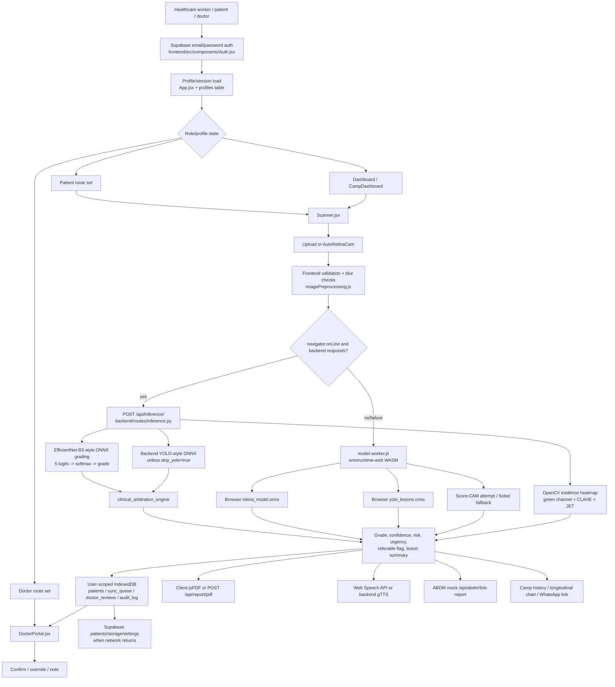
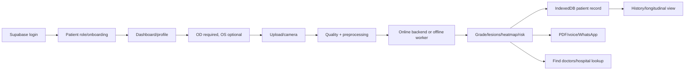
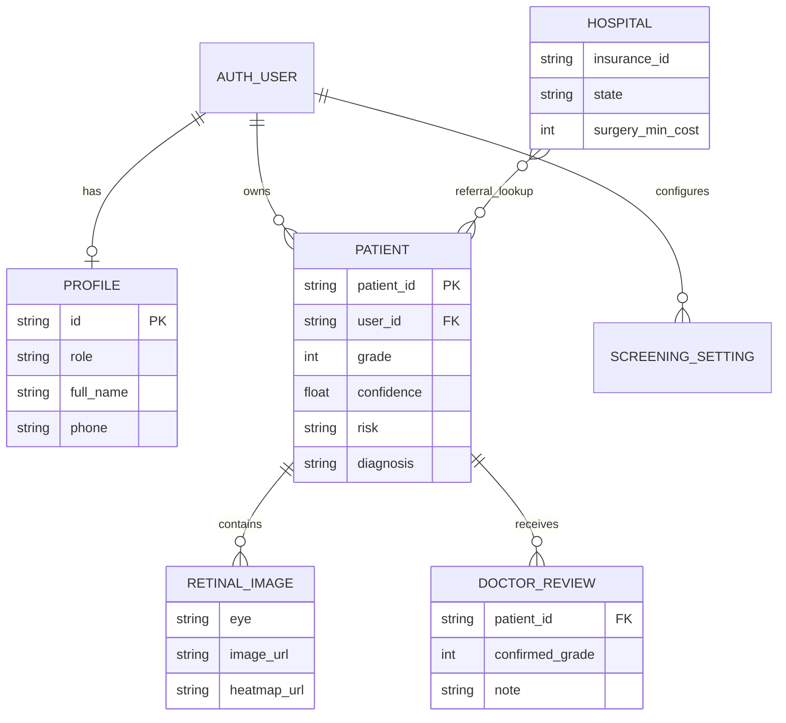

# RetinaScan AI / SightShield AI — SIH2026 Technical Architecture, PPT Content & Evidence Audit

> **Repository audited:** `THOUFIKUR/sih2026`  
> **Problem statement:** SIH26038 — Explainable AI for Diabetic Retinopathy Screening in Rural India  
> **Repository state inspected:** `main`  
> **Audit rule:** This document distinguishes code evidence from README/UI claims. Where the repository does not prove a claim, it is marked **NOT VERIFIED IN SOURCE CODE**.

## 1. Executive summary

RetinaScan AI is a React/Vite Progressive Web App plus FastAPI backend for diabetic-retinopathy screening. The intended workflow is: authenticate a user, select a patient/doctor role, capture or upload fundus images, run five-grade DR classification and retinal-lesion detection, display evidence visualizations and risk/referral information, store records locally and in Supabase, and generate/share reports.

The repository contains more than one layer:

- A working-looking product prototype under `frontend/` and `backend/`.
- A PyTorch training/export pipeline under `backend/training/`.
- MATLAB scripts for image quality, CLAHE enhancement, retinal vessel segmentation, benchmark evaluation, and telemedicine simulation.
- Sample IDRiD-labelled images and DRIVE/IDRiD sample folders.
- Presentation/product pages and hard-coded demo/validation content.

### Actual implemented system in one paragraph

The deployed runtime is primarily a React PWA. `frontend/src/utils/modelInference.js` tries `POST /api/inference/` first when the browser reports that it is online. The FastAPI backend loads an ONNX grading model, optionally loads an ONNX lesion model, applies OpenCV preprocessing, computes softmax class probabilities, performs lesion post-processing, generates an OpenCV saliency-style heatmap, and applies a code-based clinical arbitration function. If the backend fails or the browser is offline, the frontend worker can load browser-side ONNX files, subject to the model assets actually being real binaries and cached. Patient data is stored in user-scoped IndexedDB and may sync to Supabase. ABHA linking is explicitly a mock route/fallback, while PDF, multilingual voice/report text, doctor review, hospital lookup, and maps are implemented to different degrees. Training scripts exist, but repository evidence does not prove that the checked-in runtime models were produced by the latest training scripts or that the claimed clinical metrics are real-world measurements.

## 2. Repository structure

```text
sih2026/
├── README.md                         # Product and quick-start claims
├── PROJECT_OVERVIEW.md               # Product architecture/feature claims
├── PROJECT_DOCUMENTATION.md          # Earlier architecture documentation
├── SIH26038.md                       # SIH problem statement and requirements
├── CONTRIBUTING.md
├── SightShield_AI_Full_Bug_Report.pdf
├── build_error.txt
├── render.yaml                       # Render backend deployment
├── vercel.json                       # Frontend SPA deployment rewrite
├── data/
│   └── samples/
│       ├── drive/                    # DRIVE sample hierarchy
│       └── idrid_samples/            # Five labelled sample JPEGs + folders
├── frontend/                         # React/Vite/PWA application
│   ├── package.json
│   ├── package-lock.json
│   ├── vite.config.js
│   ├── public/models/                # ONNX files are currently 133-byte LFS pointers
│   ├── public/wasm/                  # ONNX Runtime Web WASM assets
│   └── src/
│       ├── App.jsx
│       ├── components/
│       ├── utils/
│       └── service-worker.js
├── backend/                          # FastAPI runtime and ML tooling
│   ├── main.py
│   ├── requirements.txt
│   ├── download_models.py
│   ├── models/
│   │   ├── best_retinascan_model.pt  # 44,564,086 bytes
│   │   ├── retina_model.onnx         # 133-byte LFS pointer
│   │   └── yolo_lesions.onnx         # 133-byte LFS pointer
│   ├── routes/
│   ├── training/
│   └── scripts/
├── matlab/
│   ├── preprocessing/
│   ├── segmentation/
│   ├── validation/
│   └── simulink/
└── scripts/
    └── deploy_trained_model.py
```

**Evidence:** repository listing; `README.md`; `SIH26038.md`; `frontend/package.json`; `backend/requirements.txt`; `backend/download_models.py`; model directory listing.

## 3. Six-slide PPT content

The following is ready-to-copy content for a six-slide SIH presentation. Claims labelled **verified** should be presented as implemented code. Claims labelled **prototype/subject to validation** should not be presented as proven clinical performance.

### Slide 1 — Problem and rural-health need

**Title:** RetinaScan AI — Explainable DR Screening for Rural India

**Content:**

- Diabetic retinopathy screening is difficult to scale where ophthalmologists, bandwidth, and transport are limited.
- SIH26038 asks for image-quality assessment, retinal structure/lesion analysis, five-level DR grading, explainability, clinical validation, and telemedicine workflow simulation.
- Target users: rural healthcare workers, camp operators, ophthalmologists, and patients.
- Product goal: perform first-line screening close to the patient, retain records locally, and escalate clinically important cases.
- **Evidence:** `SIH26038.md:1-21`; `frontend/public/manifest.json`; `frontend/src/components/DoctorPortal.jsx`.

**Speaker note:** This is a screening and triage system, not an autonomous diagnosis system. A licensed clinician must confirm decisions.

### Slide 2 — Solution and end-to-end workflow

**Title:** From Fundus Image to Referral-Ready Evidence

```text
User authentication
        ↓
Role/profile onboarding
        ↓
OD/OS image capture or upload
        ↓
Quality checks and preprocessing
        ↓
EfficientNet-B3 DR grading
        +
YOLO-style lesion detection
        +
Evidence heatmap
        ↓
Clinical arbitration / referral flags
        ↓
Result, history, doctor review, PDF, ABHA mock, sharing
```

**Content:**

- Right eye is required in `Scanner.jsx`; left eye is optional.
- Online-first inference calls FastAPI; backend failure/offline status triggers browser-worker inference.
- Records are written locally before cloud synchronization.
- Doctor review supports confirmation, grade override, and short notes in IndexedDB.
- **Evidence:** `frontend/src/components/Scanner.jsx`; `frontend/src/utils/modelInference.js`; `backend/routes/inference.py`; `frontend/src/components/DoctorPortal.jsx`; `frontend/src/utils/indexedDB.js`.

### Slide 3 — AI/ML architecture and models

**Title:** Dual-Model Explainable Screening Pipeline

| Component | Runtime evidence | Current truth |
|---|---|---|
| DR classifier | `backend/routes/inference.py:100-132` loads `retina_model.onnx`; `frontend/src/utils/model.worker.js` references the browser copy | ONNX file paths are used; current checked-in ONNX files are LFS pointers, so deployment download is required |
| Architecture | `backend/training/train_dr_classifier.py:119-137` defines EfficientNet-B3, five classes, logits + feature map | Training/export architecture is verified; runtime checkpoint provenance is not fully verified |
| Lesion detector | `backend/routes/inference.py:40-97`; `model.worker.js`; `train_yolo_lesions.py` | YOLO-style ONNX execution and post-processing are coded |
| Explainability | `generate_evidence_heatmap()` in backend; browser Score-CAM/Sobel code in worker | Backend is image-processing saliency, not gradient Grad-CAM; browser Score-CAM path is an approximation/fallback |
| Clinical logic | `clinical_arbitration_engine()` | Code applies microaneurysm/hemorrhage/exudate rules and ETDRS-like 4-2-1 logic; clinical validity is not established |

**Important:** the training script prints a `yolo26n.pt` command, while the runtime comments/documentation often say YOLOv8. The exact YOLO version of the checked-in ONNX binary is **NOT VERIFIED IN SOURCE CODE**.

### Slide 4 — Offline, multilingual, and low-connectivity design

**Title:** Edge-First Operation for Rural Camps

**Content:**

- PWA shell, service worker, IndexedDB stores, and browser ONNX worker support an offline-oriented workflow.
- First run requires downloading/caching application assets, WASM runtime assets, and model binaries. The repository does not prove that every device has already cached them.
- Subsequent runs can reuse cached assets, subject to browser storage quota and model availability.
- Local browser speech uses Web Speech API when a matching voice exists.
- Regional-language fallback calls backend gTTS; that fallback is not offline.
- Supported voice/report languages in source: English, Hindi, Tamil, Telugu, Kannada, Malayalam.
- **Evidence:** `frontend/vite.config.js`; `frontend/src/service-worker.js`; `frontend/src/utils/indexedDB.js`; `frontend/src/utils/voiceAssistant.js`; `backend/routes/tts.py`.

### Slide 5 — Clinical workflow, doctor utility, reports, and referral

**Title:** Human-in-the-Loop Clinical Operations

**Content:**

- Doctor portal filters grade ≥2 or high-risk records.
- Doctor can confirm, override grade, and add a note; persistence is local through `doctor_reviews`.
- Results show per-eye outputs, probabilities, risk score, heatmap/lesion views, history, and action buttons.
- Client PDF includes demographics, grade, confidence, both-eye image panels, heatmap/lesion panels, QR data, follow-up protocol, and localized labels.
- Hospital lookup queries Supabase `hospitals` by insurance ID or state and cost ordering.
- ABHA/ABDM route is a mock that validates 14 digits and simulates a two-second delay; it is not a real government connection.
- WhatsApp opens a `wa.me` URL with a text summary; this is client-side sharing, not an audited clinical messaging integration.
- **Evidence:** `frontend/src/components/DoctorPortal.jsx`; `frontend/src/utils/pdfReport.js`; `frontend/src/utils/hospitalLookup.js`; `backend/routes/abdm_mock.py`; `frontend/src/components/ABDMIntegration.jsx`.

### Slide 6 — Novelty, deployment, scalability, and roadmap

**Title:** What Is Distinctive and What Must Be Validated

**Implemented technical combination:**

- Edge/browser inference plus optional server inference.
- Dual-eye screening with worst-eye aggregation.
- Lesion boxes plus grade output plus a code-based clinical arbitration layer.
- Offline-first patient records and later synchronization.
- Multilingual voice/report text.
- MATLAB telemedicine simulation comparing centralized and edge-triage scenarios.

**Not yet proven:**

- Clinical sensitivity/specificity and kappa claims in MATLAB are simulated using generated/noisy labels, not evidence of a real external evaluation.
- Dataset provenance, patient-level split integrity, calibration, and regulatory readiness are not established.
- Exact production model lineage and YOLO version are not established from the binary alone.

**Roadmap:** model artifact integrity, real evaluation, privacy/RLS, signed image URLs, clinician approval audit, model version metadata, mobile performance testing, and integration tests.

## 4. Complete architecture



### Architecture node evidence

| Node | Source | Input | Output |
|---|---|---|---|
| Authentication | `Auth.jsx`; `utils/auth.js`; `supabaseClient.js` | Email/password | Supabase session |
| Role/profile | `App.jsx`; onboarding components | Session user ID | Profile role and completion state |
| Capture | `Scanner.jsx`; `AutoRetinaCam.jsx` | File/camera frame | JPEG `File`, preview data URL |
| Quality | `imagePreprocessing.js`; backend `is_blurry()` | Image/ImageData | Warnings or validation error |
| Backend inference | `backend/routes/inference.py` | Multipart image | JSON inference result |
| Browser inference | `modelInference.js`; `model.worker.js` | Image/tensor | Worker result and heatmap blob |
| Persistence | `indexedDB.js` | Patient/result object | Local record and queue item |
| Cloud sync | `indexedDB.js`; Supabase | Patient/images | Cloud row/storage URLs |
| Doctor review | `DoctorPortal.jsx` | Flagged local patient | Review/override/note |
| Report | `pdfReport.js`; `backend/routes/report.py` | Patient/result/images | Downloaded PDF |
| ABHA | `ABDMIntegration.jsx`; `abdm_mock.py` | ABHA ID/report ID | Simulated success |

## 5. Login, role, patient, and doctor flows

### Authentication architecture

Authentication is backed by Supabase email/password APIs, not a local hardcoded-user system. `Auth.jsx` calls `login()`, `signUp()`, and `supabase.auth.resetPasswordForEmail()`. `App.jsx` calls `supabase.auth.getSession()` and subscribes to auth-state changes.

- Patient login: same email/password auth; role is selected after login and stored in `profiles`.
- Doctor login: same auth mechanism; access to `/doctor` is conditionally rendered when `userProfile.role === 'doctor'`.
- Admin login: **NOT VERIFIED IN SOURCE CODE**.
- JWT/session internals: delegated to Supabase; custom JWT implementation is not present.
- Server-side role authorization: **NOT VERIFIED IN SOURCE CODE**; most role routing is frontend-side.

### Patient workflow



The flow is implemented in `App.jsx`, `Scanner.jsx`, `modelInference.js`, `indexedDB.js`, `ResultsView.jsx`, `pdfReport.js`, `voiceAssistant.js`, and `hospitalLookup.js`. The exact external referral/appointment transaction is **NOT VERIFIED IN SOURCE CODE**.

### Doctor workflow

```mermaid
flowchart TD
    A[Supabase login] --> B[Doctor profile/onboarding]
    B --> C[/doctor route]
    C --> D[getAllPatients from IndexedDB]
    D --> E[Filter grade >=2 or HIGH risk]
    E --> F[Review image, heatmap, confidence, diagnosis]
    F --> G[Confirm grade]
    F --> H[Override grade]
    F --> I[Add <=150-character note]
    G --> J[doctor_reviews store]
    H --> J
    I --> J
```

The doctor portal is a real local review UI. It does not prove a cloud-based multi-doctor collaboration system, server-side authorization, legally signed approval, appointment booking, or referral case management.

## 6. Image pipeline

### Runtime backend pipeline

```text
multipart UploadFile
  ↓
cv2.imdecode
  ↓
BGR → RGB
  ↓
Laplacian variance blur check
  ↓
resize to 300×300 for grading
  ↓
ImageNet normalization
  ↓
CHW float32 tensor [1,3,300,300]
  ↓
ONNX grading session
  ↓
softmax probabilities
  ↓
optional 1024×1024 lesion detector
  ↓
confidence threshold + NMS
  ↓
clinical_arbitration_engine
  ↓
CLAHE/green-channel evidence heatmap
  ↓
JSON response
```

**Evidence:** `backend/routes/inference.py:264-337`.

### Backend grading preprocessing

- Resize: `300×300` in current `backend/routes/inference.py:102`.
- RGB channels: first three channels.
- Normalization: mean `[0.485, 0.456, 0.406]`, std `[0.229, 0.224, 0.225]`.
- Tensor: channels-first float32, `[1,3,300,300]`.
- Model input name: hardcoded as `input`.

### Training preprocessing

`backend/training/train_dr_classifier.py:68-83` uses `300×300`, random horizontal/vertical flips, ±15° rotation, color jitter, ImageNet normalization. However, its export section uses a `224×224` dummy tensor at lines 245-258, while the runtime backend uses `300×300`. This is a material preprocessing/model-contract inconsistency. The actual ONNX graph input shape must be inspected at deployment; **the repository does not prove that the current binary accepts 300×300**.

### Frontend preprocessing

The frontend utility files are present, but the exact current `model.worker.js` and `modelInference.js` contents should be treated as the implementation source for browser shape. Earlier project documentation reports a 224×224 path, while the current backend training/runtime uses 300×300. **Do not claim one shared input contract without verifying the current browser worker code and ONNX metadata.**

### MATLAB preprocessing

- `check_image_quality.m`: Laplacian variance, entropy, mean intensity, FOV coverage; thresholds default to focus 80 and entropy 4, though entropy is reported rather than used in the final rejection logic.
- `adaptive_clahe_retina.m`: green-channel extraction and `adapthisteq`, default clip limit 0.02 and `[8 8]` tiles.
- `segment_retinal_vessels.m`: green channel, CLAHE, `fibermetric`, threshold `graythresh * 0.85`, `bwareaopen(...,30)`.

These MATLAB modules are not shown as being invoked by the FastAPI request path.

## 7. AI/ML model audit

### Model truth table

| Model Name | Claimed | File Exists | Imported | Loaded | Inference Executed | Task | Status |
|---|---:|---:|---:|---:|---:|---|---|
| EfficientNet-B3-style `retina_model.onnx` | Yes | Path exists; current file is 133-byte LFS pointer | Yes via ONNX Runtime | Yes if a real binary is downloaded | Yes in backend code when artifact is valid | Five-grade DR classification | Runtime path implemented; current checkout requires model download |
| Browser `retina_model.onnx` | Yes | Path exists; current file is 133-byte LFS pointer | Yes via `onnxruntime-web` worker | Intended, but fails without real binary/cache | Intended browser fallback | Offline DR classification | Not runnable from pointer-only checkout until assets are restored |
| YOLO-style `yolo_lesions.onnx` | Yes | Path exists; current file is 133-byte LFS pointer | Yes in backend and worker | Yes if download succeeds | Yes when `skip_yolo=false` and artifact valid | Lesion detection | Runtime path implemented; exact version not verified |
| `best_retinascan_model.pt` | Training artifact claim | Yes, 44.6 MB | Training code defines PyTorch architecture, but runtime does not load this file | Not loaded by FastAPI | No runtime inference shown | PyTorch checkpoint | Present but runtime-unused; provenance/contents not verified |
| YOLO26n | Training script command only | No `yolo26n.pt` listed | No import of Ultralytics in requirements shown | No | No | Training instruction | Claimed in training printout only; not verified as deployed |
| Grad-CAM | README/UI claim | No separate `gradcam.py` found in current inspected structure | No gradient-CAM library shown | No verified backend gradient path | No verified genuine Grad-CAM execution | Explainability | Claim inconsistent with current backend implementation |

### EfficientNet-B3 analysis

The architecture is explicitly defined in `backend/training/train_dr_classifier.py:119-137`:

```text
Input image
  ↓
EfficientNet-B3 pretrained ImageNet backbone
  ↓
features
  ↓
Adaptive average pool
  ↓
flatten
  ↓
Dropout(p=0.3) + Linear(in_features, 5)
  ↓
logits
  ↓
softmax
  ↓
argmax grade 0–4
```

The training script freezes feature blocks 0–5 and fine-tunes blocks 6–7 plus classifier, uses weighted cross entropy, AdamW, cosine annealing, eight epochs, and exports ONNX with `logits` and `feature_map`. The script says EfficientNet-B3 and IDRiD ground truth, but it does not prove that the currently deployed ONNX binary is the output of the latest run.

### DR grading map

Current backend mapping in `backend/routes/inference.py:118-131`:

| Grade | Code label | ICDR-like meaning in code |
|---:|---|---|
| 0 | No Diabetic Retinopathy | Level 0 |
| 1 | Mild Diabetic Retinopathy | Level 1 / microaneurysms |
| 2 | Moderate Diabetic Retinopathy | Level 2 |
| 3 | Severe Diabetic Retinopathy | Level 3 / ETDRS reference |
| 4 | Proliferative Diabetic Retinopathy | Level 4 / neovascularization |

The neural grade is the argmax of softmax probabilities. Then `clinical_arbitration_engine()` may increase the grade to 1 if lesions exist in a grade-0 result or to 3 if the hard-coded quadrant counts satisfy the 4-2-1 condition. Final referability is `final_grade >= 2` or detected macular-edema-like exudate proximity.

This is not a learned lesion-to-grade model. It is a rule-based post-processing layer.

### Lesion detection

The detector path is coded in `backend/routes/inference.py:40-97`:

- Resize to 1024×1024.
- Normalize pixels to `[0,1]`.
- CHW tensor.
- ONNX session with CPUExecutionProvider.
- Scores over `0.25` retained.
- Boxes converted from center-width-height to image coordinates.
- OpenCV `NMSBoxes` with score threshold `0.25` and NMS threshold `0.45`.

Runtime class names:

1. `Intraretinal Hemorrhages (Flame/Blot)`
2. `Hard Exudates / Cotton Wool Spots`
3. `Microaneurysms (Sub-pixel focal dilatations)`

The training script creates labels from IDRiD masks and prints a YOLO26n training command, but no Ultralytics dependency is visible in the provided `requirements.txt`, and the exact detector binary architecture/version is not verified from source.

### Explainability truth

The current backend function is `generate_evidence_heatmap()`:

- Extract green channel.
- CLAHE with `clipLimit=2.5`, tile grid `(8,8)`.
- Subtract Gaussian background `(25,25)`.
- Threshold at 20 with `THRESH_TOZERO`.
- Gaussian blur `(15,15)`.
- Normalize and apply JET.
- Blend original 65% + heatmap 35%.

This is an image-processing evidence visualization. It is **not verified as Grad-CAM**, because it does not use model gradients, a target layer, or the model prediction. The training code exports `feature_map`, which could support Score-CAM-like processing, but the current backend does not consume that feature map for a gradient explanation.

## 8. Dataset audit

| Dataset/reference | Evidence | Actual role | Status |
|---|---|---|---|
| IDRiD | `train_dr_classifier.py` path and `train_yolo_lesions.py` mask path; `data/samples/idrid_samples` contains five labelled images | Intended classifier training and lesion-mask conversion; five sample JPEGs are present | Dataset reference verified; full training corpus and provenance not verified |
| APTOS 2019 | Training docstring/comment and MATLAB benchmark comment | Mentioned as a possible/combined clinical source | Actual files/training use not verified |
| DRIVE | `data/samples/drive` and vessel segmentation comment | Vessel segmentation reference/sample structure | Actual evaluation execution not verified |
| Messidor, EyePACS, DDR, DeepDR, STARE, HRF | No verified inspected source evidence | None | NOT VERIFIED IN SOURCE CODE |

The checked-in five files named `idrid_grade_0.jpg` through `idrid_grade_4.jpg` are demonstration samples, not enough evidence of a training corpus. The training script expects `data/samples/idrid/data/test-00000-of-00001.parquet`, which is not the same path as the visible `idrid_samples` folder. Training may therefore require external data preparation.

## 9. Training versus inference

### Training code exists

`backend/training/train_dr_classifier.py` contains:

- Parquet loading with pandas.
- Stratified 80/20 split.
- Augmentation and normalization.
- Class-weighted cross entropy.
- EfficientNet-B3 fine-tuning.
- Quadratic weighted kappa and accuracy.
- Checkpoint save.
- FP32 ONNX export.
- Dynamic INT8 quantization.
- Copy of ONNX model to frontend.

`backend/training/train_yolo_lesions.py` contains mask-to-box conversion and a training/export specification, but the shown script does not itself execute a YOLO training API; it writes a YAML and prints commands.

### Inference code exists

`backend/routes/inference.py` runs ONNX inference at request time. `download_models.py` restores model binaries from GitHub CDN when files are missing or smaller than 10 MB.

### Provenance limitation

The repository does not contain a complete reproducible record linking the current `retina_model.onnx` and `yolo_lesions.onnx` binaries to a successful training run. The current model files are LFS pointers, while a `.pt` file exists. **Exact deployed checkpoint lineage is NOT VERIFIED IN SOURCE CODE.**

## 10. Multilingual and voice support

### Verified language list

English (`en-IN`), Hindi (`hi-IN`), Tamil (`ta-IN`), Telugu (`te-IN`), Kannada (`kn-IN`), and Malayalam (`ml-IN`) are listed in `frontend/src/utils/voiceAssistant.js`.

### What is implemented

- Static language-specific voice scripts are generated in `generateScript()`.
- Browser `speechSynthesis` is used when a matching local voice is present.
- If no non-English native voice is available, the frontend calls `http://localhost:8000/api/tts/`.
- Backend `tts.py` uses gTTS and streams MP3.
- PDF translations are statically defined in `pdfReport.js`; font loading is attempted through local fonts and Google Fonts fallback.

### What is not implemented

- Multilingual AI input understanding: not applicable to image model and not shown.
- Speech recognition/voice input: **NOT VERIFIED IN SOURCE CODE**.
- Fully offline regional-language TTS: not implemented because gTTS fallback requires network/backend.
- Translation API/LLM: not present; translations are hard-coded strings.

## 11. Offline operation: first run versus second run

| Feature | Offline status | Evidence/dependency |
|---|---|---|
| PWA shell | Intended offline after service-worker installation | `vite.config.js`, `service-worker.js` |
| IndexedDB record save | Implemented locally | `frontend/src/utils/indexedDB.js` |
| Browser grading | Intended offline | Browser model + ONNX WASM must be real and cached |
| Browser YOLO | Intended offline | Browser model + WASM must be real and cached |
| Backend inference | Not offline | Requires reachable FastAPI server |
| Client PDF | Can be offline if JS/fonts/assets are cached | `pdfReport.js`, `pdfFonts.js` |
| Supabase sync | Not offline; queued/retried | Supabase network required |
| Web Speech native voice | May work offline if OS voice exists | Browser/device dependent |
| gTTS voice fallback | Not offline | Backend/network required |
| ABHA link | Not offline and mock only | `abdm_mock.py` / client fallback |
| Hospital lookup | Not offline unless cached elsewhere | Supabase `hospitals` query |

**First run:** install/load the PWA, download the model and WASM assets, initialize IndexedDB, and authenticate/profile-load if cloud access is used. The repository contains 133-byte ONNX pointers in both backend and frontend model directories, so the deployment/startup download mechanism must run before inference.

**Second run:** cached service-worker assets and local IndexedDB can reduce network dependence. This is conditional on successful caching, browser quota, model availability, and supported WebAssembly/browser features. It is not proof that every feature works offline.

## 12. Reports, insurance, hospital lookup, and maps

### PDF

The client report uses jsPDF and QRCode. It includes localized text, demographics, grade, risk, confidence, urgency, original/heatmap/lesion panels, follow-up protocol, lesion inventory, timestamps, and QR data. It can optionally query hospital data for high grades.

The server report at `backend/routes/report.py` is much smaller: it writes patient, grade, confidence, and recommendation to an A4 PDF. It does not prove that every rich client field appears in the server report.

### ABHA/ABDM

`abdm_mock.py` explicitly describes itself as a mock. It validates 14 digits and returns a simulated success response after two seconds. The client also falls back to a local two-second mock when the backend is unreachable. Real ABDM authentication, consent, FHIR exchange, health-record discovery, and government endpoint communication are **NOT VERIFIED IN SOURCE CODE**.

### Insurance and hospitals

`hospitalLookup.js` queries Supabase `hospitals` by `insurance_id` and/or `state`, ordering by surgery cost. This is a database lookup, not an insurance claim submission. Claim adjudication, preauthorization, payment, policy verification, and insurer API integration are **NOT VERIFIED IN SOURCE CODE**.

### Location mapping

Leaflet/react-leaflet dependencies and `FindDoctors.jsx`/hospital lookup components indicate a location/doctor discovery UI. Exact geocoding, GPS, route calculation, live hospital coordinates, and map backend must be verified in those component implementations; where not directly connected to a real provider, mark them UI/data lookup only. A real insurance-based hospital match is evidenced only by the Supabase `hospitals` query.

## 13. Database and storage

### Supabase resources referenced by source

- `profiles`: user role/profile fields.
- `patients`: patient and screening records.
- `screening_settings`: standard/preventative mode.
- `hospitals`: insurance ID/state lookup.
- Storage bucket `patient-scans`: retinal images/heatmaps.

### IndexedDB stores

- `patients`
- `sync_queue`
- `doctor_reviews`
- `audit_log`

The database is user-scoped through `RetinaScanDB_<uid>`. Patient records are written locally first. Cloud failures are enqueued and retried on the browser `online` event.



Actual Supabase schema migrations, RLS policies, uniqueness constraints, and foreign keys are **NOT VERIFIED IN SOURCE CODE**.

## 14. Frontend architecture

- React 19 + Vite 7.
- React Router route shell in `App.jsx`.
- TailwindCSS styling and responsive/mobile navigation.
- Supabase auth/profile state held through React state and context.
- IndexedDB provides offline persistence.
- `modelInference.js` is the inference orchestration layer.
- Web Worker isolates ONNX computation from the UI thread.
- jsPDF/QRCode provide client report generation.
- Leaflet/react-leaflet dependencies support map UI.
- No Redux/Zustand store is visible; state is component state, context, sessionStorage, localStorage, IndexedDB, and Supabase.

Important route components include `/`, `/scan`, `/results`, `/camp`, `/doctor`, `/find-doctors`, `/profile`, `/business`, `/validation`, and `/yolo-results` as evidenced by `App.jsx` and component listing.

## 15. Backend architecture

```text
Frontend React/PWA
      ↓ fetch / multipart / JSON
FastAPI main.py
      ↓ router registration
routes/inference.py  → ONNX Runtime + OpenCV + arbitration
routes/report.py     → ReportLab PDF
routes/abdm_mock.py  → simulated ABHA link
routes/tts.py        → gTTS MP3
      ↓
Supabase is accessed primarily by frontend utilities, not a backend ORM layer.
```

The backend has no visible separate service/repository/schema layer. Business and inference logic are concentrated in route modules. CORS currently allows all origins. Authentication enforcement in FastAPI routes is **NOT VERIFIED IN SOURCE CODE**.

## 16. API table

| Endpoint | Method | Purpose | Input | Output | Source |
|---|---|---|---|---|---|
| `/health` | GET | Service health | None | JSON status | `backend/main.py` |
| `/` | GET | Root status | None | JSON message | `backend/main.py` |
| `/api/inference/` | POST | Grade/detect/explain | multipart `file`, `skip_yolo` query | JSON inference package | `backend/routes/inference.py` |
| `/api/report/pdf` | POST | Minimal server PDF | `ReportRequest` | PDF stream | `backend/routes/report.py` |
| `/api/abdm/link-report` | POST | Mock ABHA link | `abha_id`, `report_id` | simulated success | `backend/routes/abdm_mock.py` |
| `/api/tts/` | GET | Cloud TTS | `text`, `lang` | MP3 stream | `backend/routes/tts.py` |

## 17. Feature truth table

| Feature | UI exists | Backend exists | Actually works | Mock/static | Evidence/status |
|---|---:|---:|---:|---:|---|
| Email/password login | Yes | Supabase service | Yes if Supabase env/config exists | No | `Auth.jsx`, `auth.js` |
| Patient role/onboarding | Yes | Profile table expected | Partially verified | No | `App.jsx`, onboarding components |
| Doctor role/portal | Yes | No backend doctor API | Local review works | No | `DoctorPortal.jsx`, IndexedDB |
| Image upload | Yes | Yes | Yes | No | `Scanner.jsx`, inference route |
| Camera capture | Yes | Receives resulting file | Device-dependent | No | `AutoRetinaCam.jsx` |
| DR classification | Yes | Yes | Requires real ONNX binary | No | `run_grading()` |
| YOLO lesion detection | Yes | Yes | Requires real ONNX binary | No | `run_lesion_detection()` |
| Clinical arbitration | Result UI | Yes | Code path executes | Rule-based | `clinical_arbitration_engine()` |
| Grad-CAM | Claimed | No verified Grad-CAM | No genuine backend Grad-CAM proof | Evidence heatmap/Score-CAM attempt | `generate_evidence_heatmap()` |
| Confidence | Yes | Softmax output | Computed from logits | Not manually fixed in normal path | `run_grading()` |
| Risk score | Yes | Hardcoded grade map | Computed mapping | Rule/table based | `MAP` in inference |
| Offline storage | Yes | N/A | IndexedDB local path | No | `indexedDB.js` |
| Offline AI | Yes/claimed | N/A | Conditional on model/WASM cache | No | worker + model pointers |
| Supabase history | Yes | Frontend Supabase | Conditional on schema/RLS | No | `indexedDB.js` |
| PDF | Yes | Minimal API PDF | Client rich PDF; server minimal | No | `pdfReport.js`, `report.py` |
| Multilingual PDF | Yes | N/A | Static translation/font path | No | `pdfReport.js`, `pdfFonts.js` |
| Multilingual voice | Yes | gTTS fallback | Native voice or network fallback | No | `voiceAssistant.js`, `tts.py` |
| ABHA link | Yes | Yes | Simulated only | Yes | `abdm_mock.py` |
| FHIR | Not evidenced | No | No | No | NOT VERIFIED |
| Insurance claim | UI lookup language | No claim API | No | Lookup only | `hospitalLookup.js` |
| Hospital lookup | Yes | Supabase table query | Conditional on data | No | `hospitalLookup.js` |
| Live doctor appointment | UI concept possible | No verified API | NOT VERIFIED | Possibly UI-only | component audit required |
| WhatsApp | Yes | No | Opens `wa.me` text link | No | `PDFGenerator.jsx`, `ResultsView.jsx` |
| MATLAB vessel segmentation | Script exists | Separate MATLAB | Works when run with toolbox/data | No | `.m` files |
| Telemedicine simulation | Script exists | Separate MATLAB | Simulated model | Simulated scenario | `run_telemedicine_simulation.m` |
| Clinical benchmark | Script exists | Separate MATLAB | Uses generated/noisy labels | Simulated evaluation | `evaluate_icdr_benchmarks.m` |

## 18. Mock, simulated, static, and unverified features

1. **ABDM link:** explicitly named mock; fixed delay and success response. `backend/routes/abdm_mock.py`.
2. **Client ABHA fallback:** success is set even when backend fails after a delay. `ABDMIntegration.jsx:59-76`.
3. **Evidence heatmap:** backend is CLAHE/high-frequency image processing, not verified Grad-CAM. `backend/routes/inference.py:142-174`.
4. **Benchmark metrics:** `evaluate_icdr_benchmarks.m` creates `groundTruth`, adds random noise with `rng(42)`, and prints a benchmark verdict. This is a simulation, not a real model evaluation.
5. **Telemedicine cost/turnaround figures:** `run_telemedicine_simulation.m` uses assumed parameters such as 100,000 patients, 85% non-referable, ₹450 versus ₹18, and 14 days versus 4 minutes. These are scenario outputs, not measured deployment data.
6. **Demo images:** five `idrid_grade_*.jpg` files are samples, not proof of full dataset training.
7. **Model download:** `download_models.py` downloads binaries from GitHub CDN when files are below 10 MB; it does not verify cryptographic checksums.
8. **Training claims:** scripts define intended training and export, but current deployment artifact lineage is not proven.
9. **UI metrics:** any displayed accuracy/sensitivity/volume numbers in presentation components must be treated as claims unless tied to a real evaluation artifact.
10. **Insurance:** hospital lookup by `insurance_id` is not an insurance claim workflow.
11. **Hospital/doctor map:** data lookup/UI presence does not prove real-time location, navigation, availability, or appointment booking.

## 19. Technical problems and risks

### CRITICAL

- Runtime model files in the checked-in `backend/models/` and `frontend/public/models/` are 133-byte LFS pointers. Inference cannot work unless model download/LFS restoration succeeds.
- The runtime grading path uses 300×300, while the export section of `train_dr_classifier.py` uses 224×224. ONNX input contract must be checked before claiming the deployed model works.
- Backend CORS allows all origins; routes do not visibly enforce authenticated ownership or clinician roles.
- Medical data/image privacy controls, Supabase RLS, signed URLs, consent, and deletion policies are not verified.

### HIGH

- Exact model binary/version/provenance is not recorded in metadata.
- YOLO runtime comments/training command disagree: README references YOLOv8, training output says YOLO26n, while the exact loaded ONNX version is not verifiable.
- Claimed Grad-CAM is not implemented as a verified gradient-based method in backend code.
- MATLAB clinical benchmark uses simulated labels/noise, so printed sensitivity/specificity/kappa must not be presented as clinical validation.
- YOLO training script describes STAL/NMS-free objectives but runtime uses ordinary OpenCV NMS.
- There is no visible backend authorization middleware, audit-grade doctor sign-off, or server-side review API.

### MEDIUM

- `skip_yolo` can bypass lesion analysis; the UI must clearly communicate when detections are absent.
- Backend and frontend may have different preprocessing/model shapes and class-label formatting.
- Model download has no checksum/version pinning.
- Large model/WASM assets create slow first-run and storage-quota risk.
- gTTS fallback is network-dependent and hardcoded to localhost in `voiceAssistant.js`.
- Manual tests and deployment scripts are not a complete automated test suite.
- Supabase hospital query fallback can select all hospitals before client-side matching.

### LOW

- Product names and README structure do not always match current repository structure.
- Presentation/product metrics and code comments can be mistaken for measured results.
- Runtime logic is concentrated in route files rather than isolated services.

## 20. Medical-AI risks

- **Dataset mismatch:** training path references IDRiD/Aptos concepts, but actual full corpus and labels are not proven in this checkout.
- **Domain shift:** rural cameras, illumination, field-of-view, compression, and operator differences may differ substantially from training data.
- **Class imbalance:** class weighting is implemented in training, but independent external calibration is not shown.
- **False negatives:** small microaneurysms, blur, and camera artifacts can cause missed referable disease.
- **False positives:** rule arbitration may escalate from detections without validating detector precision.
- **Confidence calibration:** softmax probability is displayed as confidence; calibration curves or reliability analysis are not shown.
- **Clinical rule assumptions:** optic-disc/fovea coordinates in `clinical_arbitration_engine()` are geometric estimates, not detected anatomical landmarks.
- **Explainability:** saliency visualization may highlight image contrast rather than causal model evidence.
- **No clinical effectiveness claim:** repository evidence does not prove sensitivity, specificity, safety, or regulatory compliance.

## 21. Deployment architecture, scalability, and cost

### Deployment evidence

- Vercel SPA deployment is configured by `vercel.json` and frontend Vite/PWA files.
- Render deployment is configured in `render.yaml`, with `python download_models.py` before Uvicorn.
- `backend/download_models.py` also references Railway/Render in comments.
- Backend runtime is Python 3.11 and FastAPI/Uvicorn.
- Browser model execution uses ONNX Runtime Web/WASM when assets are available.

### Scalability

**Good architectural direction:** edge inference reduces image upload volume and specialist review load; IndexedDB allows disconnected work; server can be stateless for inference.

**Scaling requirements before production:**

- Store models in versioned object storage/CDN with checksums.
- Use private image storage and signed URLs.
- Add queueing for specialist review and idempotent sync.
- Add database indexes and RLS.
- Separate inference workers from API request workers.
- Add model warmup, concurrency limits, memory monitoring, and observability.
- Avoid loading 1024×1024 YOLO concurrently for many browser tabs without device testing.

### Cost effectiveness

The MATLAB simulation provides scenario estimates such as ₹18 versus ₹450 per patient and 85% workload reduction. These are **simulated assumptions**, not audited operating costs. Real cost must include device/camera, connectivity, storage, support, model hosting, clinician review, consent/compliance, and maintenance.

## 22. Mobile requirements and real-life usage

The project is designed as a PWA and can run in a mobile browser if the browser supports camera access, IndexedDB, service workers, WebAssembly, sufficient memory, and persistent storage. Exact minimum RAM/CPU/device list is **NOT VERIFIED IN SOURCE CODE**.

Practical operational requirements:

- Android/iOS browser with camera permission.
- Enough storage for approximately tens of MB of model files plus WASM/runtime/cache; exact total varies by build.
- Stable first-run connection for assets/model download.
- Fundus camera or suitable image source; the repository does not verify a hardware adapter.
- For cloud sync, Supabase connectivity.
- For non-native regional voice fallback, backend/gTTS connectivity.

## 23. Actual architecture versus claims

| Area | README/UI claim | Actual source evidence | Status |
|---|---|---|---|
| Offline PWA | Full offline operation | Service worker, IndexedDB, worker path; model pointers and network-dependent services remain | Partial/conditional |
| EfficientNet-B3 | Claimed | Training architecture and runtime name | Implemented path; artifact contract needs validation |
| YOLOv8 | Claimed in docs | Runtime YOLO-like parser; training script prints YOLO26n | Exact version unverified |
| Grad-CAM | Claimed | Backend uses CLAHE/high-frequency JET heatmap | Claim overstated |
| Multilingual | Six languages | Static scripts/PDF labels and TTS | Implemented partially |
| ABHA/ABDM | Government-ready | Mock validator/delay response | Mock only |
| Insurance | Insurance/hospital guidance | Supabase hospital lookup by insurance ID | Lookup only; claims not implemented |
| Clinical validation | MATLAB benchmark | Randomized simulated evaluation | Not real clinical validation |
| Training | Production training scripts | EfficientNet script and YOLO specification | Training code exists; current artifact lineage unverified |
| Doctor workflow | Doctor portal | Local IndexedDB review actions | Implemented locally; server authorization not verified |
| Location mapping | Map/doctor discovery dependencies/components | Exact real-time provider integration not fully verified | Partial/UNVERIFIED |

## 24. What is technically distinctive

### Genuinely implemented or materially coded

- Hybrid browser/backend ONNX execution strategy.
- Offline local persistence and synchronization queue.
- Five-grade classifier with explicit clinical management mapping.
- Lesion detector post-processing and class inventory.
- Rule-based clinical arbitration using lesion counts, quadrants, and foveal distance estimates.
- Dual-eye result structure and worst-eye patient aggregation.
- Local doctor review with confirmation/override/note.
- Localized PDF/voice content for Indian languages.
- MATLAB quality, enhancement, segmentation, and telemedicine simulation modules.

### Partial or unverified

- True Grad-CAM/Score-CAM linkage.
- Clinical validity of ETDRS/CSME implementation.
- Exact deployed YOLO version.
- Actual trained model provenance.
- Real ABDM/FHIR interoperability.
- Real insurance claims and hospital navigation.
- Benchmark performance.

## 25. Recommended next-level upgrades

| Current | Problem | Minimal upgrade | Why |
|---|---|---|---|
| LFS pointer models + runtime downloader | Missing/checksum-free artifacts | Add model manifest with SHA-256, version, input/output metadata, signed release | Prevent silent wrong-model deployment |
| 300×300 runtime vs 224×224 export | Input contract mismatch | Standardize one resolution and add startup shape assertion | Prevent invalid inference |
| Mock/saliency heatmap | Misleading Grad-CAM label | Rename to evidence map or implement validated model-linked Score-CAM | Honest explainability |
| Frontend role gate | No verified server role enforcement | Add Supabase RLS and backend auth verification | Protect health records |
| Local doctor reviews | No central audited sign-off | Add server review table, actor ID, timestamp, immutable audit events | Clinical accountability |
| ABHA mock | Not a real integration | Implement consented ABDM/FHIR adapter behind feature flag | Safe interoperability |
| Simulated metrics | Cannot support effectiveness claim | Add real held-out/external evaluation pipeline with patient-level splits | Valid performance evidence |
| gTTS localhost fallback | Not offline/deployable | Use configurable TTS URL plus native offline fallback/status | Reliable multilingual operation |
| Large model cache | First-run/storage burden | Lazy download, progress, quota handling, model eviction/versioning | Better low-end mobile UX |
| Hard-coded class labels/risk tables | Duplication and drift | Versioned shared schema/config | Keep frontend/backend consistent |
| Browser/cloud duplicate paths | Divergent preprocessing | Golden-image contract tests comparing both paths | Reduce silent prediction differences |

## 26. File-to-feature map

| File | Responsibility | Key dependency/consumer |
|---|---|---|
| `backend/main.py` | FastAPI app and router registration | FastAPI |
| `backend/routes/inference.py` | Grading, YOLO, heatmap, arbitration | ONNX Runtime, OpenCV, NumPy |
| `backend/routes/report.py` | Minimal PDF endpoint | ReportLab |
| `backend/routes/abdm_mock.py` | Simulated ABHA link | FastAPI/Pydantic |
| `backend/routes/tts.py` | Network TTS | gTTS |
| `backend/download_models.py` | Restore real model binaries | GitHub CDN |
| `backend/training/train_dr_classifier.py` | EfficientNet training/export/quantization | PyTorch, torchvision, ONNX Runtime |
| `backend/training/train_yolo_lesions.py` | IDRiD masks to YOLO labels/config | OpenCV/NumPy |
| `frontend/src/App.jsx` | Routing/auth/profile/PWA layout | React Router/Supabase |
| `frontend/src/components/Scanner.jsx` | Capture and scan orchestration | modelInference/IndexedDB |
| `frontend/src/components/ResultsView.jsx` | Results/actions/history | report/voice/ABDM |
| `frontend/src/components/DoctorPortal.jsx` | Local clinician review | IndexedDB |
| `frontend/src/utils/modelInference.js` | Backend-first/offline fallback | fetch/Web Worker |
| `frontend/src/utils/model.worker.js` | Browser ONNX execution | onnxruntime-web/WASM |
| `frontend/src/utils/indexedDB.js` | Local records/sync/reviews/audit | idb/Supabase |
| `frontend/src/utils/pdfReport.js` | Rich client PDF | jsPDF/QRCode/fonts |
| `frontend/src/utils/voiceAssistant.js` | Localized script and speech | Web Speech API/gTTS fallback |
| `frontend/src/utils/hospitalLookup.js` | Insurance/state hospital lookup | Supabase |
| `matlab/preprocessing/check_image_quality.m` | MATLAB IQA | Image Processing Toolbox |
| `matlab/preprocessing/adaptive_clahe_retina.m` | Green-channel CLAHE | MATLAB |
| `matlab/segmentation/segment_retinal_vessels.m` | Vessel segmentation | `fibermetric`, morphology |
| `matlab/validation/evaluate_icdr_benchmarks.m` | Simulated benchmark report | MATLAB statistics functions |
| `matlab/simulink/run_telemedicine_simulation.m` | Scenario capacity/cost simulation | MATLAB |

## 27. Final technical assessment

1. **Genuinely implemented:** React PWA shell, Supabase auth calls, role/onboarding routes, image upload/camera UI, FastAPI inference route, ONNX Runtime integration, YOLO-style detection post-processing, rule-based arbitration, IndexedDB stores, client PDF, localized static voice/report text, local doctor review, and MATLAB processing/simulation scripts.
2. **Partially implemented:** offline inference, cloud synchronization, multilingual voice, hospital lookup, model training/export, dual-eye workflow, and deployment automation depend on external assets, services, schemas, and runtime conditions.
3. **Mock/UI-only:** ABDM linking, client fallback ABHA success, benchmark performance claims, cost/turnaround simulation outputs, and backend “Grad-CAM” naming.
4. **Unverified:** real clinical performance, external validation, exact model binary provenance, exact YOLO version, real insurance claims, FHIR/ABDM interoperability, full hospital/doctor location functionality, and production security controls.
5. **Actual model families visible in source:** EfficientNet-B3-style classifier; YOLO-style lesion detector; ONNX Runtime for execution; PyTorch/torchvision for training/export; OpenCV post-processing. YOLO26 is only a printed training command, not proven as the loaded runtime model.
6. **Datasets actually evidenced:** IDRiD sample files and references, DRIVE sample hierarchy/reference, and APTOS references in training/validation comments. A full training corpus and real evaluation split are not proven.
7. **Major weaknesses:** model pointer/artifact handling, input-resolution mismatch, broad CORS, unverified authorization/RLS, simulated clinical benchmark, misleading explainability labels, no model manifest/checksum, and missing production-grade tests/observability.
8. **Major architectural weakness:** frontend, backend, training, and MATLAB pipelines are separate implementations with duplicated assumptions and no single versioned model/data contract.
9. **Most important improvements:** lock model artifacts and metadata, standardize preprocessing/input shape, implement authenticated server/RLS controls, replace simulated metrics with real patient-level external evaluation, make explainability terminology truthful, and separate demo/mock paths from clinical paths.

This document is a technical project/PPT preparation artifact. It does not establish medical safety, clinical effectiveness, regulatory approval, or government integration.
